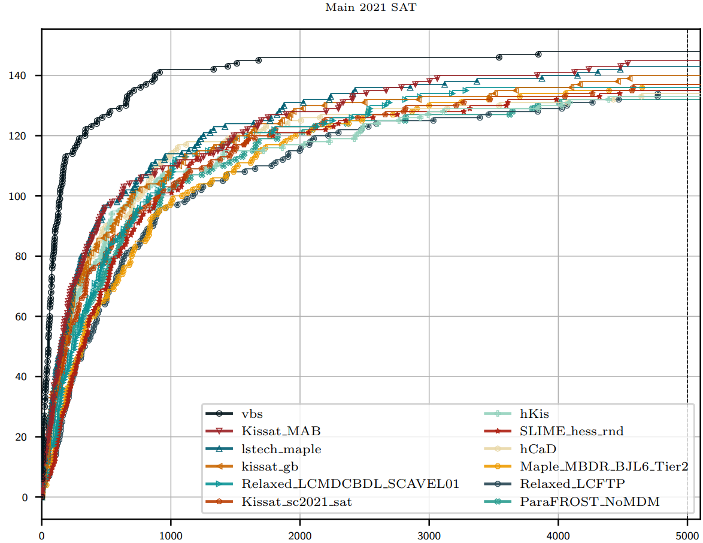

# The Top Three SAT Solvers of 2021

The [SAT 2021](http://www.satcompetition.org/) conference was held on July 5th in Barcelona.

The proceedings can be found [here](https://link.springer.com/content/pdf/10.1007%2F978-3-030-80223-3.pdf), and the results/slides can be found [here](https://satcompetition.github.io/2021/slides/ISC2021-fixed.pdf).

---

The winners of the main track were:
- [kissat_MAB](https://link.springer.com/content/pdf/10.1007%2F978-3-030-80223-3.pdf#page=500): (PAR-2: 2222, 148 solved), by Mohamed Sami Cherif, Djamal Habet and Cyril Terrioux.
- [lstech_maple](https://link.springer.com/content/pdf/10.1007%2F978-3-030-80223-3.pdf#page=76): (PAR-2: 2358, 144 solved), by Xindi Zhang, Shaowei Cai, and Zhihan Chen.
- [kissat_gb](https://arxiv.org/pdf/2105.04595.pdf): (PAR-2: 2430, 143 solved), by Md Solimul Chowdhury, Martin Müller and Jia-Huai You.



The source code of the solvers was taken from the [SAT 2021 repository](https://github.com/satcompetition/2021/blob/master/downloads/solvers-main.tar.xz).

---
## Usage
To use the SAT solvers within a Linux machine, enter the following:
```bash
# Compile the SAT solvers
./compile_SATs.sh

# Run the default "simple.cnf" file against all the SAT solvers
./run_SATs.sh

# Run any DIMACS file against all the SAT solvers
./run_SATs.sh PATH_TO_SAT_INSTANCE.cnf
```
